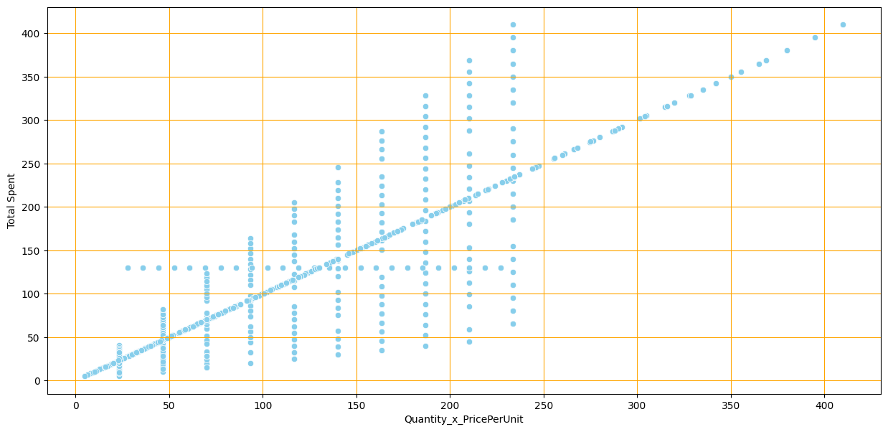
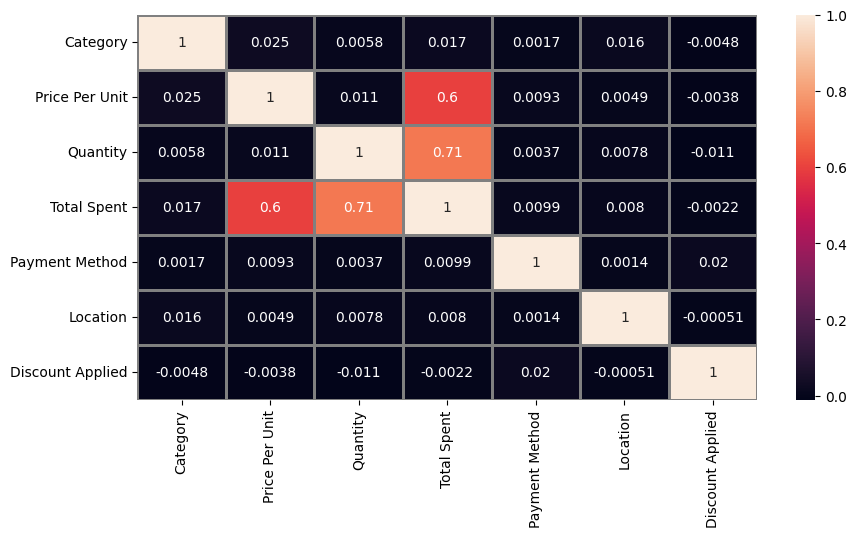

# 🛒 Customer Purchase Behavior Analysis  
*A Data Visualization & Correlation Study Using Python*

This repository contains a complete exploratory data analysis (EDA) of customer purchase behavior. The goal is to understand how **Quantity**, **Price Per Unit**, and other features influence **Total Spent**, and to identify meaningful relationships through visualizations and correlation analysis.

---

## 📌 Project Overview  
This project analyzes a synthetic/real customer transaction dataset containing features like:

- **Category**
- **Price Per Unit**
- **Quantity**
- **Total Spent**
- **Payment Method**
- **Location**
- **Discount Applied**

The project demonstrates:

✔ Data cleaning & preprocessing  
✔ Data visualization using `matplotlib` & `seaborn`  
✔ Correlation analysis  
✔ Scatter plots to analyze spending patterns  
✔ Interpretation of results  

---

## 📊 Visualizations

### **1. Quantity × PricePerUnit vs Total Spent – Scatter Plot**

This scatter plot visualizes how the product of **Quantity × Price Per Unit** relates to **Total Spent**.

#### 🔍 Key Insights:
- As expected, **Total Spent** increases as `Quantity × PricePerUnit` increases.
- There is a strong positive linear trend.
- Some points deviate slightly, likely due to applied discounts or variation in purchase behavior.

**Plot Example:**

*(Displayed as generated in the notebook)*



---

### **2. Correlation Heatmap**

The heatmap visualizes the correlation matrix for all numerical and encoded categorical variables.

#### 🔍 Key Insights:
- **Total Spent** is highly correlated with:
  - **Quantity (0.71)**
  - **Price Per Unit (0.60)**
- Other features such as *Category*, *Payment Method*, *Location*, and *Discount Applied* show **very low or near-zero correlation**, meaning they do not strongly impact spending.
- This confirms that **Quantity** and **Price Per Unit** are the major drivers of revenue.

**Heatmap Example:**



---

## 🧠 Interpretation of Results

### ✔ Strongest Contributors to Total Spent  
| Variable | Correlation with Total Spent | Interpretation |
|---------|------------------------------|---------------|
| **Quantity** | **0.71** | More items → higher total |
| **Price Per Unit** | **0.60** | Costlier items → higher spending |

This means customers who buy **more quantity** or buy **costlier items** predictably spend more.

---

### ✔ Negligible Correlation Variables  
Features such as:

- Category  
- Payment Method  
- Location  
- Discount Applied  

show **very weak or no correlations**, implying:

👉 They do **not directly influence** revenue significantly  
👉 They may influence *customer preference or segmentation* instead

---

## 🛠 Technologies Used  

| Tool / Library | Purpose |
|----------------|---------|
| **Python** | Data processing & modeling |
| **Pandas** | Data manipulation |
| **NumPy** | Numerical computation |
| **Matplotlib** | Scatter plots |
| **Seaborn** | Heatmaps & statistical visualizations |
| **Jupyter Notebook** | Interactive analysis |

---

## 📁 Folder Structure

    📦 Customer-Purchase-Analysis
    ├── 📄 README.md
    ├── 📓 analysis.ipynb
    ├── 📊 images/
    │   ├── scatter_plot.png
    │   └── heatmap.png
    └── 📂 data/
        └── dataset.csv


---

## 🚀 How to Run the Project

### 1️⃣ Clone the repository
```bash
git clone https://github.com/yourusername/customer-purchase-analysis.git
cd customer-purchase-analysis

